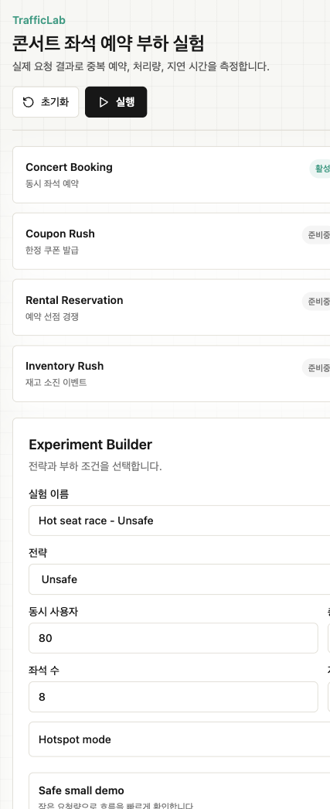

# TrafficLab

[](https://github.com/jinhyuk9714/TrafficLab/actions/workflows/ci.yml)

TrafficLab은 콘서트 좌석 예약처럼 짧은 시간에 요청이 몰리는 상황을 실제로 실행하고, 동시성 제어 전략별 결과를 측정하는 풀스택 부하 실험 플랫폼입니다.

MVP는 **콘서트 좌석 예약** 하나에 집중합니다. 사용자는 전략, 동시 사용자 수, 총 요청 수, 좌석 수, hotspot 여부, 인위적 처리 지연을 설정하고 실행합니다. 백엔드는 실제 예약 시도를 수행하고 저장된 결과로만 성공 수, 실패 수, 중복 예약 수, 처리량, latency percentile을 계산합니다.



## 왜 만들었나

동시성 문제는 설명만으로 설득하기 어렵습니다. `SELECT`, `UPDATE`, Redis Lock, JPA `@Version`, DB row lock이 어떤 차이를 만드는지 직접 실행하고 숫자로 비교해야 합니다. TrafficLab은 포트폴리오에서 “동시성 제어를 이해한다”를 코드, 데이터, 화면, 문서로 보여주기 위한 프로젝트입니다.

## 핵심 데모 시나리오

- 여러 사용자가 한정된 콘서트 좌석을 동시에 예약합니다.
- Hotspot mode가 켜지면 대부분의 요청이 1번 또는 소수 좌석에 집중됩니다.
- `UNSAFE` 전략은 의도적으로 보호 장치를 두지 않아 중복 성공 예약이 발생할 수 있습니다.
- 안전 전략은 애플리케이션 레벨 또는 DB/Redis 레벨에서 중복 성공 예약을 막습니다.

## Architecture

```mermaid
flowchart LR
    User["Browser Dashboard"] -->|REST| Frontend["Next.js Frontend"]
    Frontend -->|REST API| Backend["Spring Boot API"]
    Frontend -->|SSE /api/runs/{id}/events| Backend
    Backend --> Runner["Async Experiment Runner"]
    Runner --> Strategies["Reservation Strategies"]
    Strategies --> Postgres["PostgreSQL\nexperiments, runs, seats, reservations, events"]
    Strategies --> Redis["Redis\nSET NX lock"]
    Runner --> Metrics["Metric Calculator"]
    Metrics --> Postgres
```

## Tech Stack

- Backend: Java 21, Spring Boot 3, Spring Web, Spring Data JPA, Validation, Actuator
- Persistence: PostgreSQL
- Locking: JPA `@Version`, JPA pessimistic write lock, Redis `SET NX` with TTL and token release
- Realtime: Server-Sent Events
- Tests: JUnit 5, H2 fallback tests, Testcontainers dependencies available
- Frontend: Next.js, TypeScript, Tailwind CSS, Recharts, lucide-react
- Infra: Docker Compose

## Local Setup

Backend:

```bash
cd backend
./gradlew bootRun
./gradlew test
```

Frontend:

```bash
cd frontend
npm install
npm run dev
npm run build
```

Docker:

```bash
cp .env.example .env
docker compose up --build
```

기본 포트가 이미 사용 중이면 host port만 바꿔 실행할 수 있습니다. 컨테이너 내부 통신은 그대로 유지됩니다.

```bash
POSTGRES_PORT=5433 REDIS_PORT=6380 BACKEND_PORT=8081 \
NEXT_PUBLIC_API_BASE_URL=http://localhost:8081 \
docker compose up --build
```

- Frontend: http://localhost:3000
- Backend: http://localhost:8080
- PostgreSQL: localhost:5432
- Redis: localhost:6379

## Render 배포 준비

이 저장소는 Render Blueprint로 무료 public demo를 만들 수 있도록 `render.yaml`을 포함합니다. 실제 리소스 생성은 Render Dashboard에서 Blueprint를 연결할 때 일어납니다.

기본 Blueprint 구성:

- `trafficlab-web-jinhyuk9714`: Next.js frontend public web service
- `trafficlab-api-jinhyuk9714`: Spring Boot backend public web service
- `trafficlab-db-jinhyuk9714`: Render Postgres free instance
- `trafficlab-kv-jinhyuk9714`: Render Key Value free instance

배포 순서:

1. GitHub `main`이 최신이고 CI badge가 passing인지 확인합니다.
2. Render Dashboard에서 **New > Blueprint**를 선택합니다.
3. `jinhyuk9714/TrafficLab` 저장소를 연결하고 root의 `render.yaml`을 사용합니다.
4. Blueprint sync 후 backend health를 확인합니다.

```bash
curl -fsS https://trafficlab-api-jinhyuk9714.onrender.com/actuator/health
```

5. frontend를 열고 데모 실험을 실행합니다.

```bash
open https://trafficlab-web-jinhyuk9714.onrender.com
API_BASE_URL=https://trafficlab-api-jinhyuk9714.onrender.com ./scripts/demo-smoke.sh
```

Render service slug가 이미 사용 중이면 `render.yaml`에서 `trafficlab-api-jinhyuk9714`, `trafficlab-web-jinhyuk9714` 이름을 같은 suffix로 함께 바꿔야 합니다. 특히 frontend의 `NEXT_PUBLIC_API_BASE_URL`과 backend의 `TRAFFICLAB_CORS_ALLOWED_ORIGINS` 안에 들어 있는 `.onrender.com` URL도 같은 값으로 맞춰야 합니다.

무료 plan 주의사항:

- Free web service는 cold start가 있어 첫 요청 latency가 크게 튈 수 있습니다.
- Free Key Value는 디스크 영속성이 없으므로 Redis lock 실험용으로만 사용합니다.
- 동시성 benchmark 수치는 Render free instance 리소스와 cold start의 영향을 받습니다. 포트폴리오 수치 비교는 로컬 Docker 또는 paid/stable instance에서 다시 캡처하는 편이 더 정확합니다.

## Backend API Summary

| Method | Path | Description |
| --- | --- | --- |
| GET | `/api/scenarios` | 사용 가능한 시나리오 조회 |
| POST | `/api/experiments` | 실험 설정 생성 |
| GET | `/api/experiments` | 실험 목록 조회 |
| GET | `/api/experiments/{experimentId}` | 실험 상세 조회 |
| POST | `/api/experiments/{experimentId}/runs` | 비동기 실행 시작 |
| GET | `/api/experiments/{experimentId}/runs` | 실험별 실행 이력 조회 |
| GET | `/api/runs/{runId}` | 실행 결과 요약 조회 |
| GET | `/api/runs/{runId}/events` | SSE 이벤트 스트림 |
| GET | `/api/runs/{runId}/reservations` | 예약 시도 페이지 조회 |
| GET | `/api/runs/{runId}/export` | Markdown 케이스 스터디 export |
| POST | `/api/lab/reset` | 로컬 데모 데이터 초기화 |

Example request:

```json
{
  "name": "Hot seat rush - Redis Lock",
  "scenarioType": "CONCERT_BOOKING",
  "strategyType": "REDIS_LOCK",
  "concurrentUsers": 100,
  "totalRequests": 1000,
  "targetSeatCount": 10,
  "hotspotMode": true,
  "artificialDelayMs": 20
}
```

## 동시성 전략

### UNSAFE

좌석을 읽고 사용 가능하면 인위적 지연 후 예약 성공으로 처리합니다. JPA version 보호를 우회하는 update를 사용하므로 동시에 여러 요청이 같은 좌석을 성공 예약할 수 있습니다. 이 전략은 데모용이며 비즈니스 불변식이 깨지는 모습을 보여줍니다.

### OPTIMISTIC_LOCK

`Seat` 엔티티에 `@Version`을 둡니다. 동시에 같은 좌석을 수정하면 version conflict가 발생하고 해당 요청은 실패로 기록됩니다. MVP에서는 retry를 하지 않습니다.

### PESSIMISTIC_LOCK

JPA pessimistic write lock으로 좌석 row를 `SELECT FOR UPDATE` 방식으로 잠급니다. 임계 구역이 직렬화되므로 같은 좌석의 중복 성공 예약을 막습니다.

### REDIS_LOCK

키 형식은 `trafficlab:run:{runId}:seat:{seatNumber}`입니다. Redis `SET NX`와 TTL로 락을 획득하고, UUID token이 일치할 때만 Lua script로 release합니다. 락을 얻지 못한 요청은 실패로 기록됩니다.

## Metrics

모든 지표는 `Reservation` 테이블에 저장된 실제 시도 결과에서 계산합니다.

- `totalRequests`: 저장된 예약 시도 수
- `successCount`: 성공 예약 수
- `failureCount`: 실패 예약 수
- `duplicateReservationCount`: 좌석별 성공 예약이 1개를 초과한 추가 건수
- `invariantViolationCount`: 성공 예약이 2개 이상인 좌석 수
- `throughput`: `totalRequests / elapsedSeconds`
- `p50LatencyMs`, `p95LatencyMs`, `p99LatencyMs`: 실제 시도 latency의 nearest-rank percentile
- `elapsedMs`: 실행 시작부터 완료까지의 시간

중요: `Reservation`에는 “성공 예약은 좌석당 하나” 같은 unique constraint를 두지 않습니다. TrafficLab은 실험실이므로 `UNSAFE` 전략의 불변식 위반을 숨기면 안 됩니다.

## Demo Script

1. Docker로 실행합니다.

```bash
docker compose up --build
```

2. 브라우저에서 http://localhost:3000 을 엽니다.

3. `Hot seat race` preset을 선택합니다.

- strategy: `UNSAFE`
- concurrent users: 높게 설정
- hotspot mode: ON
- artificial delay: 20ms 이상

4. 실행 버튼을 누르고 Live Run 이벤트를 관찰합니다.

5. 완료 후 Result Dashboard에서 `중복 예약`과 `invariantViolationCount`를 확인합니다.

6. `Redis lock comparison` preset을 선택하고 다시 실행합니다.

7. Redis Lock 결과에서 중복 예약 수가 0인지 확인하고, 실패 수와 latency를 Unsafe 결과와 비교합니다.

8. Case Study Export의 Markdown을 포트폴리오 문서에 활용합니다.

CLI로 같은 데모를 재현할 수도 있습니다.

```bash
API_BASE_URL=http://localhost:8080 ./scripts/demo-smoke.sh
```

포트 충돌을 피해서 backend를 `8081`에 띄운 경우:

```bash
API_BASE_URL=http://localhost:8081 ./scripts/demo-smoke.sh
```

## 실제 데모 결과 예시

아래 값은 `scripts/demo-smoke.sh`가 실제 API로 Unsafe와 Redis Lock 실험을 실행해 출력한 형태입니다. 수치는 로컬 CPU와 Docker 리소스에 따라 달라질 수 있지만, 핵심 불변식은 같아야 합니다.

```json
{
  "unsafe": {
    "status": "COMPLETED",
    "totalRequests": 120,
    "successCount": 10,
    "failureCount": 110,
    "duplicateReservationCount": 9,
    "invariantViolationCount": 1
  },
  "redisLock": {
    "status": "COMPLETED",
    "totalRequests": 120,
    "successCount": 1,
    "failureCount": 119,
    "duplicateReservationCount": 0,
    "invariantViolationCount": 0
  }
}
```

Unsafe는 같은 좌석에 여러 성공 예약을 만들 수 있고, Redis Lock은 같은 조건에서 중복 성공 예약을 0으로 유지합니다.

## Portfolio에서 보여주는 역량

- Java/Spring 기반 도메인 모델링
- JPA optimistic/pessimistic locking 이해
- Redis 분산 락 구현과 token-checked release
- 고의적 race condition 재현
- 비동기 실험 실행과 요청 단위 결과 저장
- SSE 기반 실시간 진행 스트리밍
- 저장된 결과 기반 metric 계산
- PostgreSQL/Redis/Backend/Frontend Docker Compose 구성
- 백엔드 중심 기능을 프론트엔드 대시보드로 설명하는 능력

## Tests

```bash
cd backend
./gradlew test
```

테스트 범위:

- Unsafe 전략은 고경합 상황에서 중복 성공 예약을 만들 수 있음
- Pessimistic lock은 중복 성공 예약을 막음
- Redis lock 전략은 테스트용 in-memory lock client fallback으로 중복 성공 예약을 막음
- Metric 계산은 percentile, 중복 예약 수, invariant violation 수를 올바르게 계산함
- Markdown export는 측정값을 포함함

Redis 자체 연동 테스트는 Testcontainers 의존성을 추가해 둘 수 있지만, 로컬 Docker 상태에 따라 무거워질 수 있어 MVP 기본 테스트는 in-memory lock client fallback을 사용합니다. 실제 실행에서는 `RedisDistributedLockClient`가 Redis `SET NX`와 Lua release script를 사용합니다.

CI는 GitHub Actions에서 backend, frontend, infra job으로 분리해 실행합니다.

```bash
cd frontend
npm ci
npm run build

cd ..
docker compose config --quiet
```

## Future Roadmap

- Coupon Rush 시나리오
- Inventory Rush 시나리오
- Rental Reservation 시나리오
- Waiting room / admission control
- Kafka 기반 queue 처리 실험
- Prometheus/Grafana 관찰성 대시보드
- Kubernetes 배포
- 전략별 반복 실행 비교 리포트

## Known Limitations

- MVP는 콘서트 좌석 예약만 구현합니다.
- 인증, 결제, 외부 트래픽 생성기, SaaS 과금은 없습니다.
- Spring JPA `ddl-auto=update`를 사용하므로 운영 마이그레이션 전략은 별도 작업이 필요합니다.
- 단일 애플리케이션 인스턴스 기준 SSE fan-out입니다.
- 로컬 CPU, Docker 리소스, DB isolation, Redis latency에 따라 수치가 달라질 수 있습니다.
- Redis lock 테스트는 기본적으로 fallback lock client를 사용합니다.
- Render free web service는 cold start가 있고 free Key Value는 비영속적입니다.
